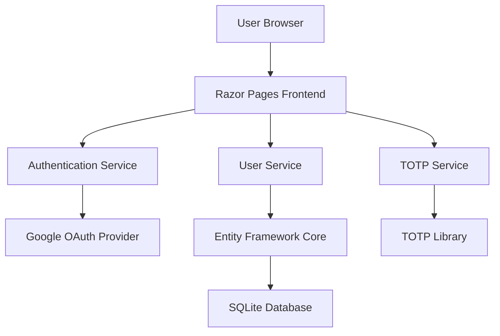

# Design Document

## Overview

This C# Razor Pages web application prototype implements Google OAuth authentication combined with TOTP-based two-factor authentication. The application follows a layered architecture with clear separation between authentication, data access, and presentation layers. The system uses ASP.NET Core Identity for user management, Google OAuth for primary authentication, and a TOTP library for generating and validating time-based one-time passwords.

## Architecture

### High-Level Architecture



### Technology Stack

- **Framework**: ASP.NET Core 8.0 with Razor Pages
- **Authentication**: ASP.NET Core Identity + Google OAuth
- **Database**: Entity Framework Core with SQLite (for prototype simplicity)
- **TOTP**: OtpNet library for TOTP generation and validation
- **QR Code**: QRCoder library for generating QR codes

## Components and Interfaces

### 1. Data Layer

#### User Entity
```csharp
public class ApplicationUser : IdentityUser
{
    public string DisplayName { get; set; }
    public string? TotpSecret { get; set; }
    public bool IsTotpEnabled { get; set; }
    public DateTime? LastTotpFailure { get; set; }
    public int TotpFailureCount { get; set; }
    public DateTime? TotpLockoutEnd { get; set; }
}
```

#### Database Context
```csharp
public class ApplicationDbContext : IdentityDbContext<ApplicationUser>
{
    // Configuration for Identity tables and custom user properties
}
```

### 2. Service Layer

#### ITotpService Interface
```csharp
public interface ITotpService
{
    string GenerateSecret();
    string GenerateQrCodeUri(string email, string secret);
    bool ValidateTotp(string secret, string code);
    byte[] GenerateQrCode(string qrCodeUri);
}
```

#### IUserService Interface
```csharp
public interface IUserService
{
    Task<bool> SetupTotpAsync(string userId, string secret);
    Task<bool> ValidateTotpAsync(string userId, string code);
    Task<bool> IsAccountLockedAsync(string userId);
    Task LockAccountAsync(string userId);
    Task ResetTotpFailuresAsync(string userId);
}
```

### 3. Presentation Layer

#### Razor Pages Structure
- `/Pages/Account/Register.cshtml` - User registration with Google OAuth
- `/Pages/Account/Login.cshtml` - Login with Google OAuth
- `/Pages/Account/SetupTotp.cshtml` - TOTP setup with QR code
- `/Pages/Account/VerifyTotp.cshtml` - TOTP verification during login
- `/Pages/Dashboard/Index.cshtml` - Protected dashboard area
- `/Pages/Account/Logout.cshtml` - Logout functionality

## Data Models

### ApplicationUser (Extended Identity User)
- **Id**: Unique identifier (inherited from IdentityUser)
- **Email**: User's email address (inherited from IdentityUser)
- **UserName**: User's chosen username (inherited from IdentityUser)
- **DisplayName**: User's display name for the application
- **TotpSecret**: Base32-encoded secret for TOTP generation
- **IsTotpEnabled**: Boolean flag indicating if TOTP is set up
- **LastTotpFailure**: Timestamp of last failed TOTP attempt
- **TotpFailureCount**: Number of consecutive TOTP failures
- **TotpLockoutEnd**: Timestamp when TOTP lockout expires

### Authentication Flow State
- **IsGoogleAuthenticated**: Session state for Google OAuth completion
- **PendingTotpUserId**: Session state for user awaiting TOTP verification
- **TotpSetupRequired**: Session state indicating TOTP setup is needed

## Error Handling

### Authentication Errors
1. **Google OAuth Failures**: Redirect to login with error message
2. **TOTP Validation Failures**: Display error, increment failure count
3. **Account Lockout**: Display lockout message with remaining time
4. **Session Expiration**: Clear session and redirect to login

### Error Logging
- Use ASP.NET Core built-in logging
- Log authentication failures for security monitoring
- Log TOTP setup and validation events
- Avoid logging sensitive information (secrets, codes)

### User-Friendly Error Messages
- Generic messages for security (avoid revealing account existence)
- Clear instructions for TOTP setup and usage
- Helpful guidance for common authentication issues

## Testing Strategy

### Unit Tests
1. **TOTP Service Tests**
   - Secret generation validation
   - QR code URI format verification
   - TOTP code validation with time windows
   - QR code image generation

2. **User Service Tests**
   - TOTP setup workflow
   - Account lockout logic
   - Failure count management
   - Lockout expiration handling

3. **Authentication Logic Tests**
   - Google OAuth integration points
   - Session state management
   - Authorization requirements

### Integration Tests
1. **Authentication Flow Tests**
   - Complete registration workflow
   - Login with Google + TOTP verification
   - TOTP setup process
   - Account lockout scenarios

2. **Page Tests**
   - Razor page rendering
   - Form submission handling
   - Redirect behavior
   - Authorization enforcement

### Manual Testing Scenarios
1. **Happy Path Testing**
   - New user registration and TOTP setup
   - Successful login with both authentication factors
   - Dashboard access and logout

2. **Error Scenario Testing**
   - Invalid TOTP codes
   - Account lockout and recovery
   - Google OAuth failures
   - Session expiration handling

## Security Considerations

### TOTP Security
- Use cryptographically secure random secret generation
- Implement time window tolerance for TOTP validation
- Store TOTP secrets encrypted in database
- Implement account lockout after failed attempts

### Session Management
- Use secure session cookies
- Implement proper session timeout
- Clear sensitive session data on logout
- Validate session state at each authentication step

### Google OAuth Security
- Validate OAuth state parameter
- Use HTTPS for all OAuth redirects
- Store OAuth tokens securely
- Implement proper token refresh handling

## Configuration Requirements

### Google OAuth Setup
- Google Cloud Console project configuration
- OAuth 2.0 client ID and secret
- Authorized redirect URIs configuration
- Required OAuth scopes (email, profile)

### Application Settings
```json
{
  "Authentication": {
    "Google": {
      "ClientId": "[Google OAuth Client ID]",
      "ClientSecret": "[Google OAuth Client Secret]"
    }
  },
  "Totp": {
    "Issuer": "Google Auth Prototype",
    "LockoutDurationMinutes": 5,
    "MaxFailureAttempts": 3
  }
}
```

### Database Configuration
- SQLite connection string for development
- Entity Framework migrations setup
- Identity configuration with custom user model