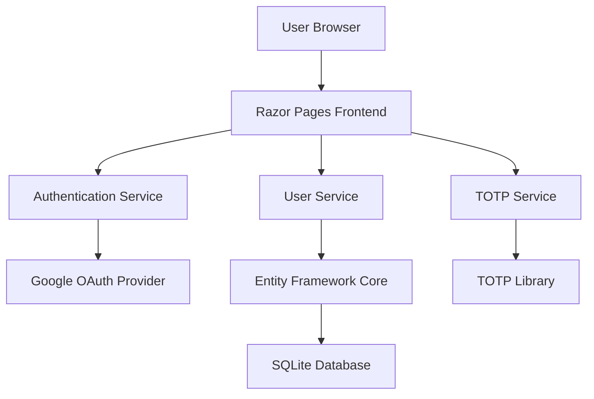

# Architecture Overview

*This document will be populated as the architecture is implemented.*

## System Architecture

The Google Auth TOTP Prototype follows a layered architecture pattern with clear separation of concerns:

### High-Level Architecture

## Technology Stack

- **Framework**: ASP.NET Core 8.0 with Razor Pages
- **Authentication**: ASP.NET Core Identity + Google OAuth
- **Database**: Entity Framework Core with SQLite
- **TOTP**: OtpNet library for TOTP generation and validation
- **QR Code**: QRCoder library for generating QR codes

## Design Principles

1. **Security First**: All authentication flows prioritize security
2. **Separation of Concerns**: Clear boundaries between layers
3. **Testability**: Components designed for easy unit testing
4. **Maintainability**: Clean, readable code with comprehensive documentation

*More details will be added as components are implemented.*