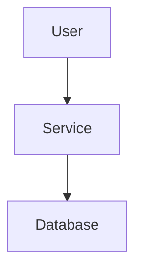

# Documentation Update Guide

## Overview

This guide explains how to update and maintain the project documentation, which is automatically deployed to GitHub Pages using Jekyll.

## Documentation Structure

```
Docs/
├── index.md                    # Documentation homepage
├── Architecture/
│   ├── Overview.md            # System architecture
│   ├── Security.md            # Security design
│   └── ErrorHandling.md       # Error handling strategy
├── Services/
│   ├── TotpService.md         # TOTP service documentation
│   └── UserService.md         # User service documentation
├── API/
│   └── Services.md            # API reference
├── Pages/
│   ├── Registration.md        # Registration page docs
│   ├── Login.md               # Login page docs
│   ├── TotpSetup.md          # TOTP setup page docs
│   ├── TotpVerification.md   # TOTP verification page docs
│   └── Dashboard.md           # Dashboard page docs
├── Configuration/
│   └── GoogleOAuth.md         # OAuth configuration
├── Deployment/
│   ├── LocalDevelopment.md    # Local setup guide
│   └── Docker.md              # Docker deployment
├── Testing/
│   └── TestingStrategy.md     # Testing approach
└── Contributing/
    └── Documentation.md       # This guide
```

## Updating Documentation

### When to Update Documentation

Update documentation when:
- Implementing new features or services
- Modifying existing functionality
- Adding new configuration options
- Creating new pages or components
- Changing architecture or design decisions

### Documentation Standards

#### File Naming
- Use PascalCase for file names (e.g., `TotpService.md`)
- Use descriptive names that match the component being documented
- Place files in appropriate subdirectories

#### Front Matter
All documentation files should include Jekyll front matter:

```yaml
---
layout: default
title: Page Title
---
```

#### Content Structure
1. **Title**: Clear, descriptive title
2. **Overview**: Brief description of the component/feature
3. **Implementation**: Technical details and code examples
4. **Usage**: How to use the component
5. **Testing**: Test coverage and examples (if applicable)

#### Code Examples
Use proper syntax highlighting:

```csharp
public interface ITotpService
{
    string GenerateSecret();
    bool ValidateTotp(string secret, string code);
}
```

#### Mermaid Diagrams
Use Mermaid for architectural diagrams:



### Updating Process

#### 1. Edit Documentation Files
- Edit markdown files in the `Docs/` directory
- Follow the existing structure and naming conventions
- Include relevant code examples and explanations

#### 2. Update Navigation (if needed)
If adding new pages, update `_config.yml`:

```yaml
navigation:
  - title: New Section
    url: /NewSection/
    subnav:
      - title: New Page
        url: /NewSection/NewPage/
```

#### 3. Test Locally (Optional)
To test documentation locally:

```bash
# Install Jekyll (if not already installed)
gem install bundler jekyll

# Create Gemfile (if not exists)
bundle init
echo 'gem "jekyll", "~> 4.3.0"' >> Gemfile
echo 'gem "minima", "~> 2.5"' >> Gemfile
bundle install

# Serve locally
bundle exec jekyll serve

# View at http://localhost:4000
```

#### 4. Commit and Push
```bash
git add Docs/
git commit -m "Update documentation for [feature/component]"
git push origin main
```

#### 5. Automatic Deployment
GitHub Actions will automatically:
- Build the Jekyll site
- Deploy to GitHub Pages
- Make documentation available at the GitHub Pages URL

## Documentation Templates

### Service Documentation Template

```markdown
---
layout: default
title: Service Name
---

# Service Name

## Overview
Brief description of the service and its purpose.

## Interface
```csharp
public interface IServiceName
{
    // Interface definition
}
```

## Implementation
Implementation details and design decisions.

## Usage Examples
```csharp
// Usage examples
```

## Testing
Test coverage and testing approach.
```

### Page Documentation Template

```markdown
---
layout: default
title: Page Name
---

# Page Name

## Overview
Description of the page and its functionality.

## Features
- Feature 1
- Feature 2
- Feature 3

## Implementation
Technical implementation details.

## User Flow
1. Step 1
2. Step 2
3. Step 3

## Testing
Integration test coverage.
```

## Best Practices

### Writing Guidelines
- Use clear, concise language
- Include code examples where helpful
- Document both happy path and error scenarios
- Keep documentation up-to-date with code changes
- Use consistent formatting and structure

### Maintenance
- Review documentation during code reviews
- Update documentation as part of feature development
- Regularly check for outdated information
- Ensure all links work correctly

### Collaboration
- Document design decisions and rationale
- Include troubleshooting information
- Provide setup and configuration details
- Make documentation accessible to new team members

## Troubleshooting

### Common Issues

#### Jekyll Build Failures
- Check YAML front matter syntax
- Ensure proper markdown formatting
- Verify file paths and links

#### Missing Pages
- Check file naming conventions
- Verify navigation configuration in `_config.yml`
- Ensure files are in correct directories

#### Styling Issues
- Verify Jekyll theme compatibility
- Check CSS class usage
- Test with different browsers

### Getting Help

For documentation issues:
1. Check the Jekyll documentation
2. Review existing documentation files for examples
3. Test changes locally before pushing
4. Ask team members for review

---

*This guide should be updated as the documentation process evolves.*