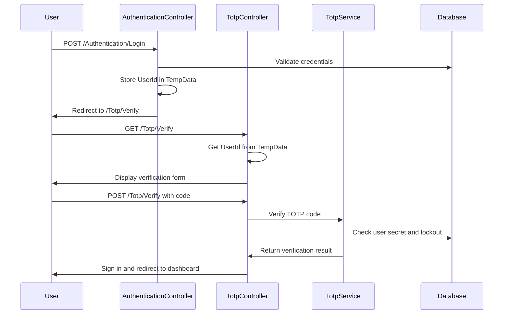

# TOTP Verification Page

## Overview

The TOTP Verification page (`/Totp/Verify`) is a critical security component that handles the second factor of authentication in the two-factor authentication flow. After users successfully authenticate with their username/password or Google OAuth, they are redirected to this page to enter their Time-based One-Time Password (TOTP) code from their authenticator app.

## Page Location

- **URL**: `/Totp/Verify`
- **Controller**: `TotpController`
- **Actions**: `Verify` (GET and POST)
- **View**: `Views/Totp/Verify.cshtml`
- **Model**: `VMPARAMTotpVerifyRequest`

## Functionality

### GET Action

The GET action displays the TOTP verification form and handles the following scenarios:

1. **Valid Session**: If a user has a pending TOTP verification (stored in TempData), displays the verification form
2. **Invalid Session**: If no pending user ID is found, redirects to the login page
3. **User Display**: Shows the username of the user attempting to verify (if available)

### POST Action

The POST action processes the TOTP verification and handles:

1. **Code Validation**: Validates the 6-digit TOTP code format and content
2. **TOTP Verification**: Verifies the code against the user's TOTP secret
3. **Success Handling**: Signs in the user and redirects to the dashboard
4. **Failure Handling**: Increments failure count and shows error messages
5. **Lockout Handling**: Locks the account after 3 failed attempts for 5 minutes

## User Interface

### Form Elements

- **Verification Code Input**: 
  - 6-digit numeric input field
  - Auto-formatted to accept only digits
  - Auto-submits when 6 digits are entered
  - Large, centered display for better usability
  - Letter-spaced for better readability

### Visual Elements

- **Security Icon**: Shield icon to emphasize security
- **Username Display**: Shows the user's name for context
- **Progress Indication**: Clear instructions on what to do
- **Error Messages**: User-friendly error messages for various scenarios

### Lockout Display

When an account is locked out, the page shows:
- Lock icon with warning styling
- Clear explanation of the lockout reason
- Information about the lockout duration (5 minutes)
- No input form (disabled during lockout)

## Security Features

### Account Lockout

- **Trigger**: 3 consecutive failed TOTP attempts
- **Duration**: 5 minutes from the last failed attempt
- **Reset**: Lockout is cleared after the time expires or on successful verification
- **Logging**: All lockout events are logged for security monitoring

### Session Management

- **TempData Usage**: User ID is stored in TempData between login and TOTP verification
- **Session Cleanup**: TempData is cleared on successful verification
- **Timeout Handling**: Expired sessions redirect to login page

### Input Validation

- **Client-Side**: JavaScript validation for format and length
- **Server-Side**: Model validation with data annotations
- **Sanitization**: Input is sanitized to prevent injection attacks

## Error Handling

### Validation Errors

- **Empty Code**: "The Code field is required"
- **Invalid Length**: "TOTP code must be exactly 6 digits"
- **Invalid Format**: "TOTP code must contain only digits"

### Authentication Errors

- **Invalid Code**: "Invalid TOTP code"
- **Account Locked**: "Account is temporarily locked due to too many failed verification attempts"
- **User Not Found**: Redirects to login page
- **TOTP Not Setup**: "TOTP is not set up for this user"

### System Errors

- **Service Unavailable**: Generic error message with logging
- **Database Errors**: Handled gracefully with user-friendly messages

## JavaScript Enhancements

### Auto-Formatting

```javascript
// Remove non-digit characters and limit to 6 digits
codeInput.addEventListener('input', function(e) {
    this.value = this.value.replace(/\D/g, '');
    if (this.value.length > 6) {
        this.value = this.value.substring(0, 6);
    }
});
```

### Auto-Submit

```javascript
// Auto-submit when 6 digits are entered
codeInput.addEventListener('input', function(e) {
    if (this.value.length === 6) {
        setTimeout(() => {
            this.form.submit();
        }, 500);
    }
});
```

## Integration with Authentication Flow

### Login Flow Integration

1. User enters credentials on login page
2. `AuthenticationController.Login` validates credentials
3. If TOTP is enabled, user ID is stored in TempData
4. User is redirected to `/Totp/Verify`
5. `TotpController.Verify` displays verification form
6. User enters TOTP code and submits
7. On success, user is signed in and redirected to dashboard

### Data Flow



## Testing

### Unit Tests

- Model validation tests
- Controller action tests
- Service integration tests

### Integration Tests

- Complete verification flow tests
- Lockout scenario tests
- Error handling tests
- Session management tests

### Manual Testing Scenarios

1. **Happy Path**: Successful TOTP verification
2. **Invalid Code**: Wrong TOTP code entry
3. **Account Lockout**: Multiple failed attempts
4. **Session Expiry**: Expired TempData handling
5. **JavaScript Functionality**: Auto-formatting and auto-submit

## Configuration

### Lockout Settings

The lockout behavior can be configured in the `TotpManagementService`:

```csharp
// Lock out after 3 failed attempts for 5 minutes (per requirements)
if (user.TotpFailureCount >= 3)
{
    user.TotpLockoutEnd = DateTime.UtcNow.AddMinutes(5);
}
```

### TempData Configuration

TempData is used for session management between login and TOTP verification:

```csharp
TempData["PendingTotpUserId"] = result.UserId;
TempData["PendingTotpUsername"] = result.Username;
```

## Security Considerations

1. **Time-based Codes**: TOTP codes are time-sensitive and expire quickly
2. **Rate Limiting**: Account lockout prevents brute force attacks
3. **Session Security**: TempData is cleared after use
4. **Logging**: Security events are logged for monitoring
5. **Input Validation**: All input is validated and sanitized
6. **HTTPS Required**: All authentication pages require HTTPS

## Accessibility

- **Keyboard Navigation**: Full keyboard support
- **Screen Readers**: Proper ARIA labels and descriptions
- **High Contrast**: Compatible with high contrast modes
- **Focus Management**: Proper focus handling and indicators
- **Error Announcements**: Screen reader friendly error messages

## Browser Compatibility

- **Modern Browsers**: Full support for Chrome, Firefox, Safari, Edge
- **JavaScript Required**: Page requires JavaScript for optimal experience
- **Progressive Enhancement**: Basic functionality works without JavaScript
- **Mobile Responsive**: Optimized for mobile devices